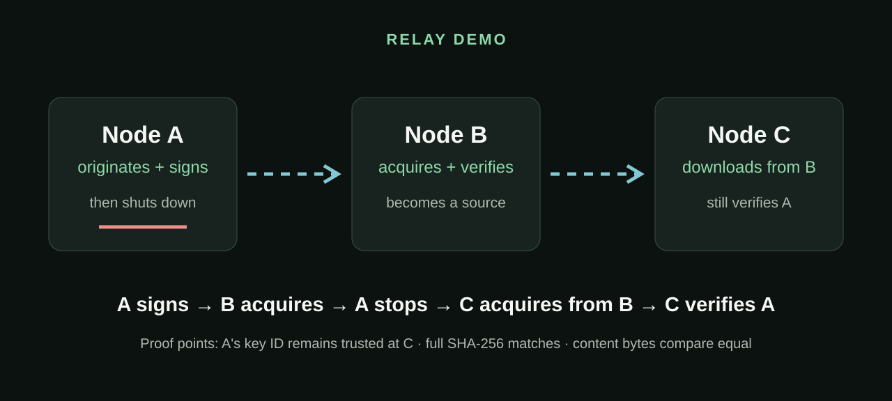
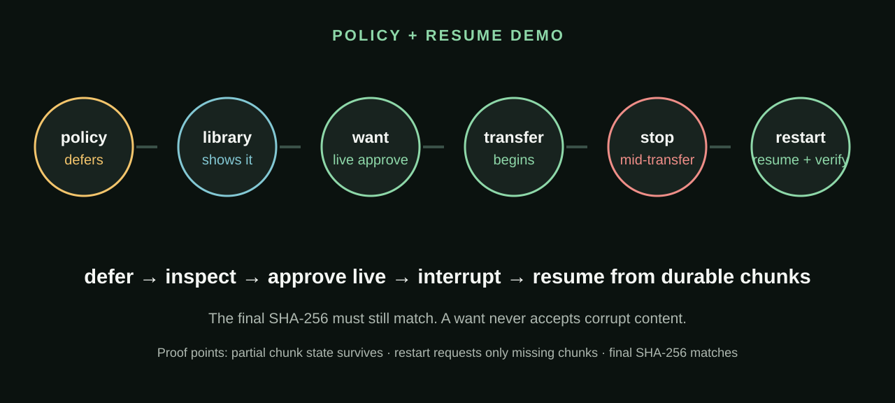
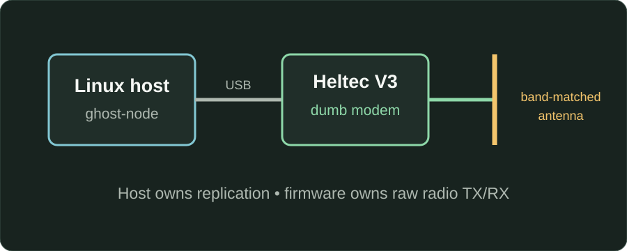

<!-- _class: title -->
<!-- _paginate: false -->

# Ghost Cache

LoRa sneakernet without the sneakers

Delay-tolerant content replication over infrastructureless radio

A &nbsp; ~~~~~&gt; &nbsp; B &nbsp; ~~~~~&gt; &nbsp; C

<!--
- Ghost Cache moves compact files directly between small Linux computers over LoRa.
- Core result: a verified receiver becomes a new source.
-->

---

## What if the Internet is not available, but the information still needs to move?

  

    <h3>Internet</h3>
    
Fast—when it exists

    
Unavailable, unreliable, damaged, or restricted.

  

  

    <h3>USB handoff</h3>
    
Reliable—but manual

    
Every update requires another physical trip.

  

  

    <h3>LoRa</h3>
    
Tiny bandwidth—autonomous

    
Compact information can propagate after deployment.

  

Ghost Cache does not replace broadband. It targets compact information when infrastructure is absent or intermittent.

<!--
- Problem is not “replace the Internet.”
- Target compact documents, bulletins, updates, and small data files.
- USB works, but repeated updates require repeated human movement.
- LoRa buys autonomous propagation at the cost of bandwidth.
- Use cases include isolated infrastructure, field work, disasters, and restricted connectivity.
-->

---

## Add once. Verify. Relay onward.

  

Linux host A

USB

LoRa modem

add file

  
~~~&gt;

  

Linux host B

USB

LoRa modem

acquire + verify

  
~~~&gt;

  

Linux host C

USB

LoRa modem

acquire from B

<strong>Once a node verifies content, it becomes another source.</strong>

No Wi-Fi · no cellular · no Internet · no central server · original source may disappear

<!--
- A physical node is a Linux host, USB LoRa modem, and band-matched antenna.
- The host runs replication logic; identical modem firmware only moves opaque packets.
- Content—not user messages or routes—is the unit of value.
- B’s verified copy is equivalent to A’s for later replication.
-->

---

## Airtime is the scarce resource

  

    <h3>Example US RF profile</h3>
    
915 MHz US example

    
SF7 · 125 kHz · CR 4/5 · 5 dBm

    
A low-power example—not a universal deployment recommendation.

  

  

    <h3>The tradeoff</h3>
    

      
fasterless airtime

      
◀━━━━━━▶

      
more sensitivitymore airtime

    

    
lower SFhigher SF

  

  

4 KiB ≈ 12 sec

small bulletin

  

16 KiB ≈ 46 sec

demo-sized publication

  

64 KiB ≈ 3.1 min

larger reference pack

<strong>Rule of thumb: ≈ 3 sec/KiB.</strong> Idealized clean-link transfer phase only; discovery, metadata, loss, retries, contention, and slower RF settings add time.

<!--
- LoRa is deliberately slow; every transmission occupies a shared channel.
- Lower SF is faster; higher SF can improve sensitivity but costs airtime.
- Under this RF profile, start with roughly 3 seconds per KiB.
- Conservative model includes 178-byte chunks, request packets, adaptive batches, scheduler quiet-time approximation, and 75 ms reply gaps.
- It excludes discovery, manifest/signature inspection, loss, retries, contention, serial overhead, and other nodes.
- 128 KiB models around 6.1 minutes; the 247.5 KiB maximum around 11.9 minutes before excluded delays.
- No fixed range claim: environment and installation dominate.
-->

---

## The network tracks content, not routes

<strong>Publication</strong> = one file plus immutable metadata: hash, filename, chunk layout, and optional signature.

  
DISCOVER

  
INSPECT

  
DECIDE

  
TRANSFER

  
VERIFY

  
REPLICATE

  
<h3>Receiver-driven</h3>
A source advertises what exists. Each receiver decides what it will acquire.

  
<h3>Delay-tolerant</h3>
Partial transfers persist, resume after restart, and can continue from another source.

<!--
- Contrast with chat or routed user-to-user messaging.
- Discovery does not automatically consume bulk airtime.
- Receiver applies local size and trust policy after inspecting metadata.
- Locally added and remotely acquired objects become identical after verification.
- Source disappearance is expected, not exceptional.
-->

---

## Compare differences, not entire inventories

  

    <h3>Plain-English goal</h3>
    
Node A: A B C D E Node B: A B C D  Discover only: “B is missing E.”

  

  

    <h3>Radix-prefix digest reconciliation</h3>
    
Compare compact summaries.

    
Descend only through differing ID prefixes.

    
Send concrete IDs only at small leaves.

  

  

5 packets · 484 bytes

1 difference among 1,000 objects

  

7 packets · 686 bytes

1 difference among 10,000 objects

Software measurement: cost follows differing branches—not every publication ID.

<!--
- Naive paging scales with total library size even when peers nearly match.
- First compare 16 compact child summaries, then only mismatched prefixes.
- Concrete IDs appear only when a branch has ten or fewer objects.
- Numbers are deterministic software measurements, not RF range tests.
- Advanced radix details are in the appendix and protocol docs.
-->

---

## Trust belongs to the receiver

SHA-256

Are these the exact bytes named by the manifest?

Ed25519

Did this signing key sign this publication metadata?

Trust policy

Does this receiver accept that key—or require any signature at all?

  

<strong>A signs X</strong> B relays unchanged C trusts A C verifies A—even when X arrives from B

  

<strong>want = explicit local override</strong> May override unsigned / untrusted policy Never overrides cryptographic failure

Traffic is plaintext. Signing is not encryption, anonymity, or identity bootstrap.

<!--
- Keep integrity, key authenticity, and local trust distinct.
- Relay path grants no trust; B never re-signs A’s publication.
- “signed” means cryptographically valid, not automatically trusted.
- Trusted key exchange happens outside Ghost Cache.
- Manual want overrides policy, never corrupted bytes or bad signatures.
-->

---

<!-- _class: demo -->
<!-- _paginate: false -->

## Demo 1 · The source disappears

  
  <video controls preload="metadata" poster="assets/relay-demo-poster.svg">
    <source src="video/relay-demo.mp4" type="video/mp4" />
  </video>
  
PDF / missing-video fallback: A signs → B acquires → A stops → C acquires from B → C verifies A

<!--
- Node A originates and signs the publication.
- Node B verifies it and becomes a source.
- A is terminated before C joins.
- C trusts A’s key, not B; hash and original signature are final proof.
-->

---

<!-- _class: demo -->
<!-- _paginate: false -->

## Demo 2 · The receiver is in control

  
  <video controls preload="metadata" poster="assets/policy-resume-poster.svg">
    <source src="video/policy-resume-demo.mp4" type="video/mp4" />
  </video>
  
PDF / missing-video fallback: defer → library → live want → interrupt → durable resume → verify

<!--
- Policy blocks bulk transfer but preserves discovered metadata.
- Library makes deferred content visible to a human.
- want is safe while the daemon runs and begins acquisition without restart.
- Stop the receiver after durable partial chunks exist.
- Restart resumes missing chunks rather than beginning at zero.
-->

---

## Headless deployment

  

    
  

  

    <h3>Deployment capabilities</h3>
    <ul>
      <li>RF settings from TOML</li>
      <li>Apply + verify modem settings at startup</li>
      <li>Non-root systemd service</li>
      <li>Stable serial paths</li>
      <li>Volatile operational logs</li>
      <li>Persistent content + recovery state</li>
    </ul>
  

Content and recovery state persist. Operational logs are volatile by default.

<!--
- Field concept is a small headless Linux host such as a Raspberry Pi-class device.
- Host config is authoritative and startup fails on RF readback mismatch.
- Non-root systemd tooling and stable serial-device configuration are included.
- Whole-node power depends on the selected host and radio hardware and must be measured.
-->

---

## What Ghost Cache is—and is not

  

    <h3 class="verified">Physically verified</h3>
    <ul class="check">
      <li>Three-node LoRa replication</li>
      <li>Arbitrary binary publications</li>
      <li>Interrupted resume + source switching</li>
      <li>Receiver-driven policy + live want</li>
      <li>Radix reconciliation</li>
      <li>Signed relay + trusted origin verification</li>
      <li>Host-applied RF configuration</li>
    </ul>
  

  

    <h3 class="future">Current boundaries</h3>
    <ul class="limit">
      <li>247.5 KiB publication maximum</li>
      <li>Plaintext RF; no anonymity</li>
      <li>No freshness or revocation semantics</li>
      <li>No automatic retention or GC</li>
      <li>Heltec V3 reference modem</li>
      <li>Range is deployment-specific</li>
      <li>No general routed messaging</li>
    </ul>
  

<!--
- These boundaries are deliberate, not hidden caveats.
- Hard systems behavior is physically demonstrated: relay, resume, policy, and trust.
- Target compact information, not video or IP-network replacement.
- No confidentiality or anonymity claim.
-->

---

<!-- _class: close -->
<!-- _paginate: false -->

# The sender can disappear. The information doesn't have to.

Ghost Cache

content-centric · receiver-driven · delay-tolerant

A &nbsp; ~~~~~&gt; &nbsp; B &nbsp; ~~~~~&gt; &nbsp; C

<!--
- Recap: compact files move without infrastructure, and verified copies become sources.
- The central behavior ran on physical radios, not only in simulation.
- Trust stays with each receiver; the original signer can be offline.
- Appendix slides contain RF and protocol detail.
-->

---

<!-- _class: appendix -->

## RF knobs in one slide

| Term | Practical meaning |
|---|---|
| LoRa | Low-bandwidth, long-range-oriented packet radio modulation |
| LoRaWAN | Gateway/network-server protocol; **not used by Ghost Cache** |
| Frequency | Where radios communicate; must match and be locally legal |
| Spreading factor | Lower is faster; higher can improve sensitivity but costs airtime |
| Bandwidth | Wider is faster; narrower may improve sensitivity |
| Coding rate | Error-correction redundancy; stronger coding costs airtime |
| RSSI / SNR | Received strength / signal relative to noise; diagnostics, not guarantees |

<!--
- Sync word separates compatible LoRa traffic but is not security.
- Radio is half duplex: it cannot receive while transmitting.
- Avoid universal range claims.
-->

---

<!-- _class: appendix -->

## GN v3 message flow

<pre><code>A advertises radix SUMMARY
B requests only differing prefixes
A returns SUMMARY or concrete LEAF IDs

B → GET_MANIFEST      A → MANIFEST
B → GET_SIGNATURE     A → SIGNATURE

B applies local policy

B → GET_CHUNKS        A → up to 4 CHUNK packets
... repeat missing chunks ...
B verifies SHA-256 + signature, then commits</code></pre>

200-byte application packets · one self-initiated addressed exchange at a time · randomized timing and bounded backoff

<!--
- Reconciliation and bulk acquisition alternate for fairness.
- Manifest and signature come from the same source.
- Chunk batches may rotate across sources afterward.
-->

---

<!-- _class: appendix -->

## Publication format

  

    <h3>Identity + integrity</h3>
    
<strong>Publication ID</strong> first 128 bits of content SHA-256

    
<strong>Authoritative hash</strong> full SHA-256 retained and verified

  

  

    <h3>Transfer + authenticity</h3>
    
<strong>Chunk content</strong> 178 bytes per packet

    
<strong>Optional signature</strong> Ed25519 over canonical immutable metadata

  

Maximum today: 1,424 chunks × 178 bytes = 253,472 bytes ≈ 247.5 KiB

<!--
- ID is compact; full hash remains authoritative.
- Signature binds hash, ID, filename, length, chunk geometry, and manifest version.
- Relays preserve signature bytes unchanged.
- Current size limit follows directly from bitmap/chunk geometry.
-->

---

<!-- _class: appendix -->

## Signing and local policy

| Receiver policy | Unsigned | Valid unknown signer | Valid trusted signer | Invalid signature |
|---|---:|---:|---:|---:|
| `permissive` | acquire | acquire | acquire | reject |
| `signed` | defer | acquire | acquire | reject |
| `trusted` | defer | defer | acquire | reject |

<strong>want</strong> overrides unsigned/untrusted and size admission—but never invalid signatures or SHA-256 failure.

Key ID = first 128 bits of SHA-256(raw Ed25519 public key). Key ownership is established outside Ghost Cache.

<!--
- “signed” means valid signature, not known human identity.
- Trusted keys are installed through an external trusted channel.
- Trust removal changes future admission; it is not network revocation.
- No automatic key exchange or PKI.
-->

---

<!-- _class: appendix -->

## Reconciliation cost: paging vs radix

| Inventory | Full-ID paging estimate | Radix, one difference |
|---:|---:|---:|
| 1,000 objects | ≈ 91 inventory packets | **5 packets / 484 bytes** |
| 10,000 objects | ≈ 910 inventory packets | **7 packets / 686 bytes** |

Paging estimate: 11 full 128-bit IDs per packet. Radix figures: deterministic Ghost Cache software measurements. Both exclude manifest inspection and content transfer.

The win appears when libraries are large and mostly equal.

<!--
- Do not compare packet counts as universal transfer latency.
- Radix walks only differing branches.
- 64-bit child digest collision could delay discovery, not accept corrupt content.
- Full SHA-256 still protects publication integrity.
-->
